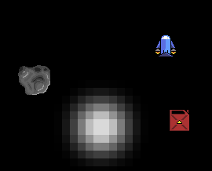

#  Fuel Leak!



Your ship has a fuel leak! Survive as long as you can by dodging asteroids and
collecting fuel cans to power your ship in this asteroids inspired game.

## Quick start

1. Ensure pygame is installed, if not run: 
```bash
pip install pygame
```
2. Clone the repository
```bash
git clone https://github.com/mattiarmston/Asteroid-Clone.git
```
3. Navigate to the installation directory
```bash
cd  Asteroid-Clone
```
4. To play, run: 
```bash
python3 __main__.py
```

## How to play

Use WASD or the Arrow Keys to move and navigate the menu. Try to avoid the
asteroids for as long as you can – but be careful! You only have 10 seconds of
fuel, which you must replenish by collecting fuel cans, which are scattered
across the screen. Try to survive as long as you can and beat your high score.

